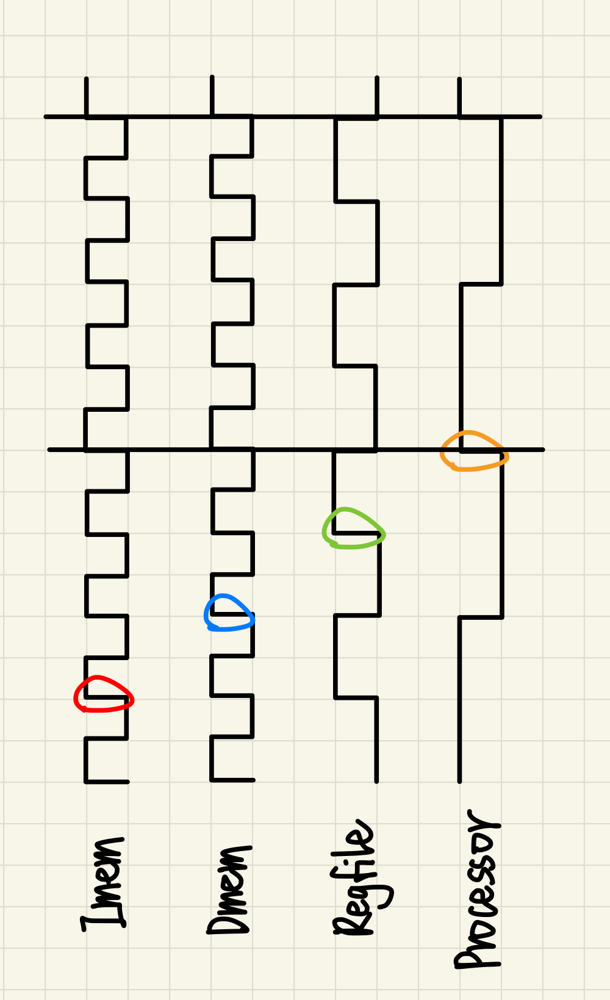

# Simple Processor

## Arithmetic Logic Unit

### Preprocessing

1. This stage is for decoding the ALU opcode.
2. First invert every opcode bit so both the true and complement forms are available.
3. Then use AND gates to match exact bit patterns, because each operation corresponds to one unique combination of opcode bits.
4. The result is a set of one-hot signals, where only the target operation’s signal goes high for a given opcode.

### Addition/Subtraction

1. The design is implemented with a 32-bit CLA (carry-lookahead adder).
2. How CLA works:
    - Speeds up addition by avoiding ripple-carry delay.
    - Compute per-bit `generate` $G_i = A_i \land B_i$ and `propagate` $P_i = A_i \oplus B_i$ in parallel.
    - Carry: $C_{i+1} = G_i \lor (P_i \land C_i)$
    - Sum: $S_i = P_i \oplus C_i$
    - Carry is recursive, so $C_{i+1}$ can be expanded directly to depend on $C_0$ (the input $C_{in}$), enabling parallel computation of all carries before computing sums.
    - Possible to group bits into blocks; for a block of 4 bits:
        $$
        P_{group} = P_3 P_2 P_1 P_0
        $$

        $$
        G_{group} = G_3 \lor (P_3 G_2) \lor (P_3 P_2 G_1) \lor (P_3 P_2 P_1 G_0)
        $$
    - A 4-bit CLA block works like a “super-bit”. Multiple blocks can be combined hierarchically and they are operated as same as 1-bit.
3. In this case, we built the 4-bit CLA block first. Then two of them are combined to create an 8-bit CLA, and finally four 8-bit CLAs are used to construct the complete 32-bit CLA.
4. For subtraction, the subtrahend is bitwise flipped and incremented by one to obtain its negation. The negated value is then added to the minuend to achieve subtraction.
5. Overflow detection is handled as follows:
    - For addition: $\text{overflow} = \lnot (A_{31} \oplus B_{31}) \land ( \text{Sum}_{31} \oplus A_{31} )$
    - For subtraction: $\text{overflow} = (A_{31} \oplus B_{31}) \land ( \text{Sum}_{31} \oplus A_{31} )$
    - The key idea is that overflow occurs only when the two operands have the same sign during addition, or different signs during subtraction. This is captured by the term $$A_{31} \oplus B_{31}$$. The second term, $$\text{Sum}_{31} \oplus A_{31}$$, then checks for overflow by comparing the sign of the result with the sign of the operands.

### AND/OR

1. Generate block iterates over all 32 bit positions.
2. At each bit, compute logical AND and OR of the bits from the two operands.
3. Results are collected into vectors to form the full 32-bit outputs.

### SLL/SRA

1. The input operand is first assigned to stage 0.
2. There are five stages of shifting, each controlled by one bit of `ctrl_shiftamt`. Stage $i$ corresponds to a shift amount of $2^i$.
3. Logical left shift (SLL):
    - For bit (index $j$) that is greater or equal to the shift amount $k$, then use MUX to choose the bit $j-k$ from previous stage to fill it.
    - Otherwise, this bit will be filled with 0.
4. Arithmetic right shift (SRA):
    - For bit (index $j$) that has not less than shift amount $k$ its to the left (which means $j+k < 32$), then use MUX to choose the bit $j+k$ from previous stage to fill it.
    - Otherwise, this bit will be filled with the sign bit of the original operand to preserve arithmetic meaning.
5. After all 5 stages, the outputs represent the fully shifted 32-bit results according to the shift amount.

### Final Output Selection

1. For each bit position, the result of every operation is ANDed with its corresponding one-hot control signal. This ensures that only the active operation passes its value, while others output 0.
2. All these masked outputs are then ORed together to form the final `data_result[i]`.
3. Repeating this for all 32 bits produces the full ALU output, selected according to the decoded opcode.

### isNotEqual/isLessThan

1. The simplest way to determine **isLessThan** is by checking if $A-B$ is negative. However, since overflow may occur, the correct expression is
    $$
    isLessThan = diff_{31} \oplus overflow
    $$
2. **isNotEqual** can be determined by checking whether the difference is zero:
    $$
    isNotEqual = Reduce\_OR(diff)
    $$
3. Therefore, an additional CLA is included, working in parallel with the main adder for addition/subtraction. This ensures that **isNotEqual** and **isLessThan** are generated independently of the selected opcode.

## Register File

### Register

1. Implemented with `dffe_ref`: a 32-bit D flip-flop with clock, enable, and async clear.
2. On the rising clock edge, if `enable` is asserted, the register captures `data`; otherwise it holds the old value. When `clear` is asserted, it resets to zero immediately.

### Regfile

1. `cmp_const5` is implemented with five XNORs + AND. It decodes IDs to compare each `reg_idx` with `ctrl_readRegA/B` and `ctrl_writeReg`, producing `sel_readA`, `sel_readB`, and `sel_write`.
2. A `generate for` loop instantiates 32 registers. Register 0 is hard-wired to 0, where reads always return 0, writes are ignored.
3. Write path: `write_enable = ctrl_writeEnable & sel_write` ensures only the selected register (except R0) captures `data_writeReg` on the next clock edge when `ctrl_writeEnable` is asserted.
4. Read path: each register conditionally drives the read buses with the tri-state buffer based on `sel_readA/B`.

## Program Counter

1. Implemented with a 32-bit DFFE.
2. A 32-bit CLA follows as the incrementer.
3. This block is driven by `process_clock`.
4. Byte-addressed, thus it increments by 4 on each rising edge since each instruction is 4 bytes.

## Instruction Memory

1. The Verilog code is generated by Quartus’s syncram, using on-chip ROM.
2. Takes a 12-bit address and outputs the 32-bit instruction at that address.
3. Uses its own clock, `imem_clock`.
4. Requires at least one cycle to return proper data for a given address.

## Data Memory

1. The Verilog code is generated by Quartus’s syncram, using on-chip single-port memory.
2. Takes a 12-bit address, 32-bit data input, and a write-enable. Outputs the 32-bit word at the address. When write-enable is set, writes the input data to that address.
3. Uses its own clock, `dmem_clock`.
4. Requires at least one cycle to return proper data for a given address.

## Processor

1. Instantiates the PC and ALU, and handle wiring and control-signal generation.
2. Important details:
    - The PC is byte-addressed while the Imem is word-addressed. Therefore using `pc[13:2]` (i.e., pc >> 2) as the Imem address.
    - lw/sw use word addressing, therefore using `alu_result[11:0]` directly as the Dmem address.
    - On ALU overflow, overwrite the destination register to R30 and replace the write back data `data_writeReg` with the instruction-specific status code.

## Skeleton

1. Acts as a top-level wrapper around the processor.
2. Instantiates the processor, Dmem, and Imem, and handles clock division to generate `processor_clock`, `imem_clock`, `dmem_clock`, and `regfile_clock`.
3. Clocking scheme:
    - Use a helper module `clk_div2N` to divide the clock frequency by 2N with parameter N.
    - Run `imem_clock` and `dmem_clock` on the fastest global clock since memories need multiple cycles to return valid data.
    - Set `regfile_clock` to half the clock because it needs to be slower than memory clocks to wait for memory data to write back, but faster than `processor_clock` so writes complete before the next instruction.
    - Make `processor_clock` the slowest, which is one quarter of clock. Then other operations can finish within one processor cycle.

4. Here is the wave diagram to illustrate more:
    - In each processor cycle, Imem returns the instruction first (red circle).
    - Regfile reads does not require clock edge raising and will return values immediately.
    - Dmem then takes the inputs and returns data (blue circle).
    - The regfile receive the data and write back afterward (green circle).
    - Finally the cycle finishes (orange circle). Next will be pc+4 and fetching the new instruction.